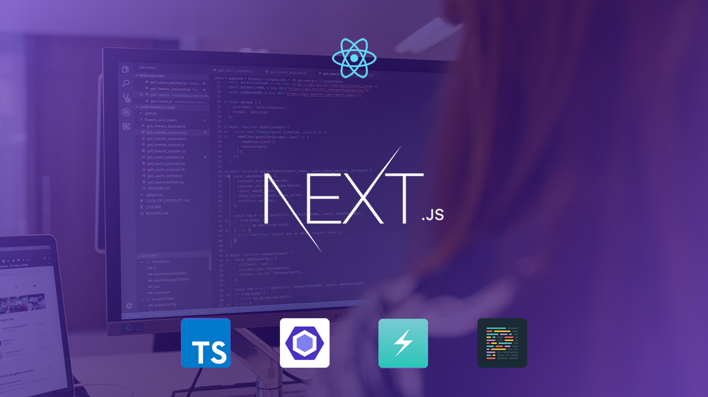

<p align="center">
  
</p>

## About

This is a ready [Next.js](https://nextjs.org) code structure with [TypeScript](https://www.typescriptlang.org), [ESLint](https://eslint.org), [Chakra UI](https://chakra-ui.com) and [Prettier](https://prettier.io) to start new projects.

## How it works

This project is only a front-end part to be used as client for a API application:

### Pre-requisites

Before you begin, you will need to have the following tools installed on your machine:

- [Git](https://git-scm.com)
- [Node.js](https://nodejs.org/en/)
- [Yarn](https://yarnpkg.com/)

In addition, it is good to have an editor to work with the code like [Visual Studio Code](https://code.visualstudio.com/).

#### Running the application

```bash

# Clone this repository
$ git clone git@github.com:cenarioweb/nextjs-boilerplate.git your-project

# Access the project folder in your terminal
$ cd your-project

# Install the dependencies
$ yarn

# Run the application in development mode
$ yarn dev

# The application will open on the port: 3000 - go to http://localhost:3000

```

## Layout

<p align="center" style="display: flex; align-items: flex-start; justify-content: space-around;">
  
  
</p>

## Status Project: In Development

### Features

- [x] Login page
- [x] Recovery password page
- [ ] Form validation
- [ ] Dashboard layout
  - [ ] Header
  - [ ] Navbar
  - [ ] Footer
- [ ] Switch light/dark mode
- [ ] Form elements
  - [x] Text input
  - [x] Password input
  - [ ] Select
  - [ ] Checkbox
  - [ ] Radio

## Tech Stack

The following tools were used in the construction of the project. Open the links to know more.

-   [React](https://reactjs.org)
-   [Next.js](https://nextjs.org)
-   [Chakra UI](https://chakra-ui.com)
-   [Framer Motion](https://www.framer.com/motion)
-   [TypeScript](https://www.typescriptlang.org)
-   [ESLint](https://eslint.org)
-   [Prettier](https://prettier.io)
-   [React Icons](https://react-icons.github.io/react-icons)
-   [Unform](https://unform.dev)
-   [Yup](https://github.com/jquense/yup)
-   [EditorConfig](https://editorConfig.org)

Check *package.json* for more packages include.

## Author

<div align="center">
 
 <br>
 <b>Carlos Eduardo</b><br><br>

[](https://github.com/carlos3duardo)
[](https://www.linkedin.com/in/cenarioweb)
[](https://www.instagram.com/carloseduardo)
[](https://www.twitter.com/carlos3duardo)
[](mailto:carloseduardo@cenarioweb.com.br)

</div>

## License

This project is under the license [MIT](./LICENSE).

